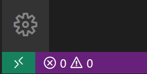
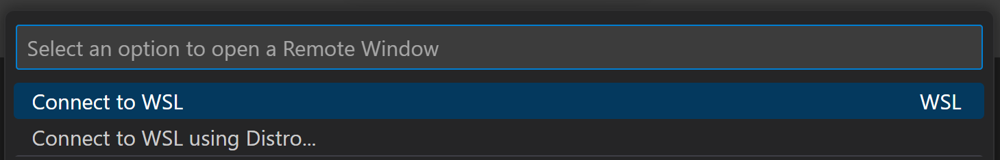
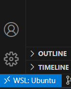
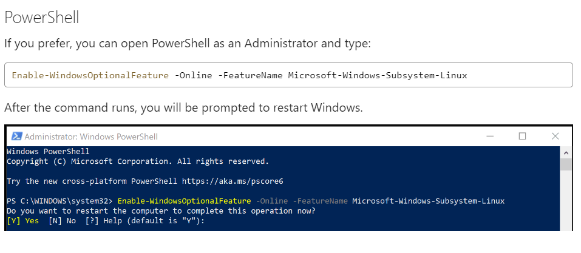
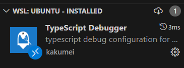
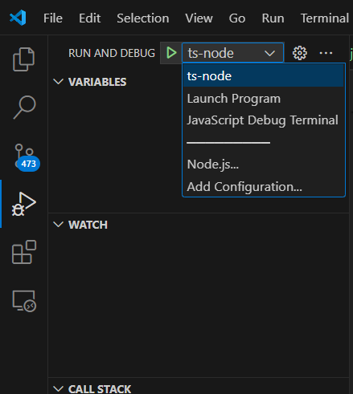

# typescript-env

https://code.visualstudio.com/docs/remote/wsl-tutorial

Install WSL Extension

Click in the remote status bar

It goest to be that way

If necessary

Install Typescript Debugger Extension

Then install ts-node locally

npm install ts-node --save-dev

put a breakpoint in test.ts

select this option and click and run

